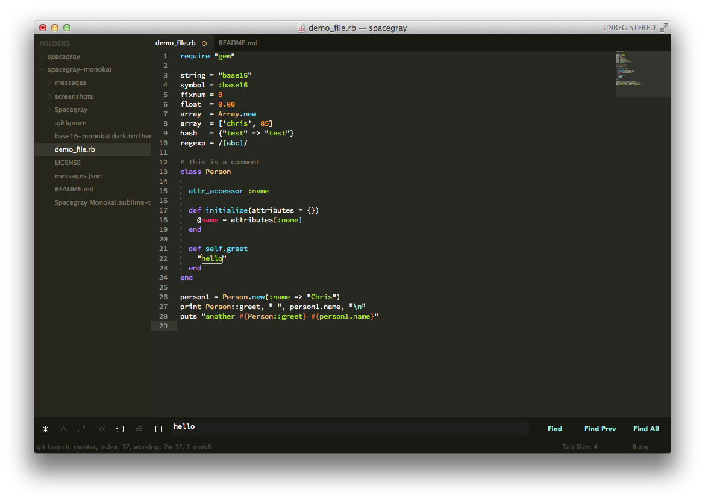

# Spacegray-Monokai

A set of Monokai UI themes for Sublime Text 2/3. It's based on [Spacegray](https://github.com/kkga/spacegray), borrowing 99% of configs & assets from it. 

Color values come from [Base16](https://github.com/chriskempson/base16) Monokai color scheme.

***

### Themes

#### Spacegray-Monokai

Default flavor based on Base16 Monokai color scheme.



#### Spacegray-Monokai Light

*Coming Eventually*


*The font used in the screenshots is [__Source Code Pro__](https://github.com/adobe/Source-Code-Pro).*

***

### How to Install

#### Via Package Control

The easiest way to install is using [Sublime Package Control](https://sublime.wbond.net), where Spacegray is listed as `Theme - Spacegray`.

1. Open Command Palette using menu item `Tools -> Command Palette...` (<kbd>⇧</kbd><kbd>⌘</kbd><kbd>P</kbd> on Mac)
2. Choose `Package Control: Install Package`
3. Find `Theme - Spacegray-Monokai` and hit <kbd>Enter</kbd>

#### Manual

You can also install the theme manually:

1. [Download the .zip](https://github.com/sprngr/spacegray-monokai/archive/master.zip)
2. Unzip and rename the folder to `Theme - Spacegray-Monokai`
3. Copy the folder into `Packages` directory, which you can find using the menu item `Sublime Text -> Preferences -> Browse Packages...`

***

### How to Activate

Activate the UI theme and color scheme by modifying your user preferences file, which you can find using the menu item `Sublime Text -> Preferences -> Settings - User` (<kbd>⌘</kbd><kbd>,</kbd> on Mac).

You can choose whichever flavor you like, but don't forget to change *both* color scheme and UI theme so they match.

***Note: Don't forget to restart Sublime Text after activating the theme.***

#### Settings for Spacegray

```json
{
  "theme": "Spacegray Monokai.sublime-theme",
  "color_scheme": "Packages/Theme - Spacegray-Monokai/base16-monkai.dark.tmTheme"
}
```

***

### Settings

#### Tab labels font size

Copy and paste one of four options in your user preferences file:

```json
  "spacegray_tabs_font_small": true
```
```json
  "spacegray_tabs_font_normal": true
```
```json
  "spacegray_tabs_font_large": true
```
```json
  "spacegray_tabs_font_xlarge": true
```

#### Tabs size

Tabs height:

```json
  "spacegray_tabs_small": true
```
```json
  "spacegray_tabs_normal": true
```
```json
  "spacegray_tabs_large": true
```
```json
  "spacegray_tabs_xlarge": true
```

Tabs width: 

```json
  "spacegray_tabs_auto_width": true
```

#### Sidebar labels font size

```json
  "spacegray_sidebar_font_small": true
```
```json
  "spacegray_sidebar_font_normal": true
```
```json
  "spacegray_sidebar_font_large": true
```
```json
  "spacegray_sidebar_font_xlarge": true
```

#### Sidebar tree rows height

```json
  "spacegray_sidebar_tree_xsmall": true
```
```json
  "spacegray_sidebar_tree_small": true
```
```json
  "spacegray_sidebar_tree_normal": true
```
```json
  "spacegray_sidebar_tree_large": true
```
```json
  "spacegray_sidebar_tree_xlarge": true
```

***

### Notes

All colors have their base16 value (00-0F) commented next to it for future use (more theming).

Any of them that have a negative sign in front of it are a shade darker of the original.

Those colors used are documented here:

* -00: #181913 // Each channel was reduced by 15
* -01: #26261d // Each channel was reduced by 19

### Thanks

Thanks to [Ghadzhi Kharkharov](https://github.com/kkga) for creating the original Spacegray themes.
